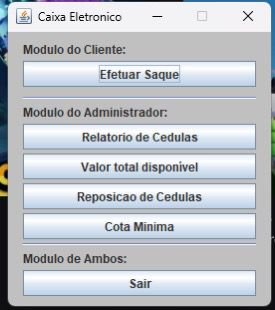

# 💻 Projeto POO - Caixa Eletrônico

Projeto desenvolvido para a disciplina de Programação Orientada a Objetos (POO).

## 📌 Descrição

Este sistema simula o funcionamento de um caixa eletrônico, permitindo:

- Saque de valores
- Relatório de cédulas disponíveis
- Consulta de saldo total
- Reposição de cédulas
- Definição de cota mínima

O sistema segue as regras definidas pela atividade da faculdade, garantindo:

- Uso das maiores notas possíveis
- Limite de cédulas por saque
- Controle de saldo
- Validação de saque

---

## ⚙️ Tecnologias Utilizadas

- Java
- Programação Orientada a Objetos (POO)
- Interface Gráfica (GUI)

---

## 👥 Integrantes do Grupo

Clique no nome para acessar o GitHub de cada integrante:

- 👤 [Damião Junior](https://github.com/juninho-Oliveira)
- 👤 [Elias Augusto](http://github.com/eliasaugustoo2203)
- 👤 [Cristhian Chagas](https://github.com/cristhianchagas)
- 👤 [Monica Castro](https://github.com/monicacastropacheco09-star)
- 👤 [Pedro Henrique](https://github.com/Pedrinxp)
- 👤 [Letícia Evangelista ](http://github.com/leticiaevang)
- 👤 [Felipe Rocha](http://github.com/fehamroim09)
- 👤 [Lucas Mendonça](https://github.com/zPhamtom)
- 👤 [Raul Adriano](https://github.com/rauladrixdev)

---

## 📊 Funcionalidades

✔ Efetuar saque  
✔ Exibir relatório de cédulas  
✔ Mostrar valor total disponível  
✔ Repor cédulas  
✔ Definir cota mínima  
✔ Bloquear saque quando necessário  

---

## 🚨 Regras do Sistema

- O saque deve usar o menor número de notas possível  
- Prioridade para notas maiores (100 → 2)  
- Máximo de 30 cédulas por saque  
- Caso não seja possível sacar:  